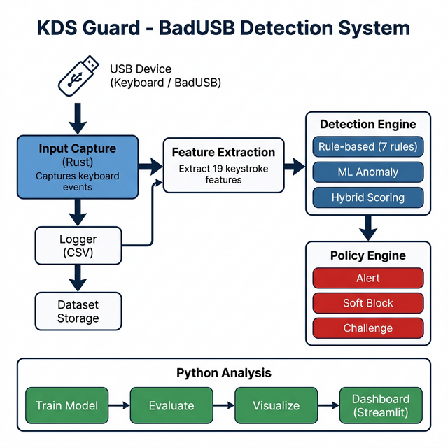
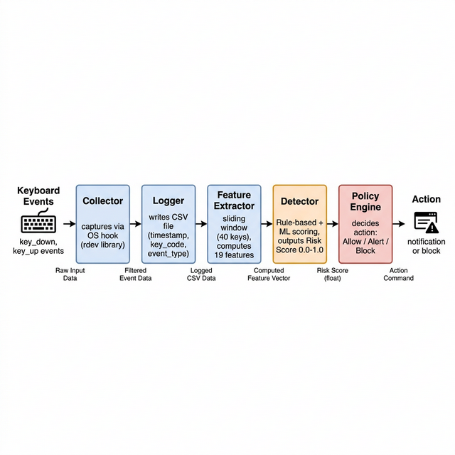
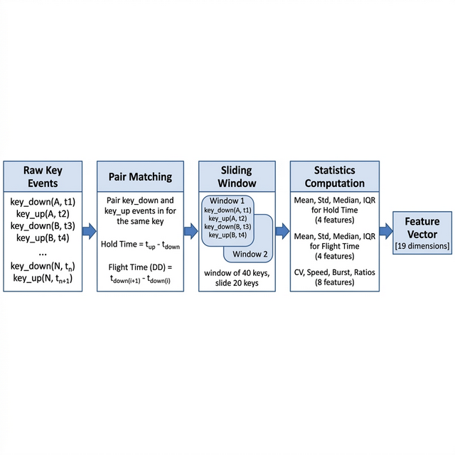
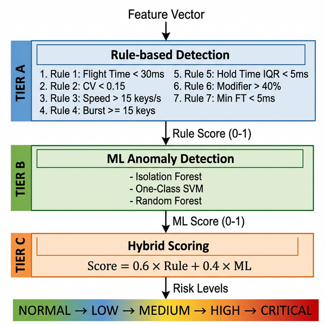

# Chương 2. CƠ SỞ LÝ THUYẾT

## 2.1. Giao tiếp USB và thiết bị HID

### 2.1.1. Tổng quan USB (Universal Serial Bus)

USB (Universal Serial Bus) là chuẩn giao tiếp phổ biến nhất cho kết nối thiết bị ngoại vi với máy tính. Ra đời năm 1996, USB đã trải qua nhiều phiên bản:

*Bảng 2.1: Các phiên bản USB và tốc độ*

| Phiên bản | Tốc độ tối đa | Năm ra đời |
|-----------|---------------|------------|
| USB 1.0   | 1.5 Mbps      | 1996       |
| USB 2.0   | 480 Mbps      | 2000       |
| USB 3.0   | 5 Gbps        | 2008       |
| USB 3.1   | 10 Gbps       | 2013       |
| USB 4.0   | 40 Gbps       | 2019       |

Kiến trúc USB dựa trên mô hình **host-device**: máy tính (host) điều khiển giao tiếp, thiết bị (device) phản hồi. Khi thiết bị được cắm vào, quá trình **enumeration** diễn ra:

1. **Phát hiện kết nối**: Host nhận biết có thiết bị mới.
2. **Reset và gán địa chỉ**: Host gán địa chỉ duy nhất cho thiết bị.
3. **Lấy descriptor**: Host đọc Device Descriptor, Configuration Descriptor, Interface Descriptor.
4. **Tải driver**: Host tải driver phù hợp dựa trên class code.
5. **Sẵn sàng sử dụng**: Thiết bị hoạt động với driver đã tải.

### 2.1.2. Thiết bị HID (Human Interface Device)

HID là một lớp thiết bị USB được thiết kế cho các thiết bị tương tác trực tiếp với con người: bàn phím, chuột, gamepad, touchscreen.

**Đặc điểm quan trọng của HID:**

- **Plug-and-Play**: Hệ điều hành có driver HID tích hợp sẵn, không cần cài thêm.
- **Tin tưởng tự động**: Mọi thiết bị tự nhận diện là HID đều được OS chấp nhận ngay lập tức mà **không yêu cầu xác thực**.
- **Report-based protocol**: Dữ liệu truyền qua HID Reports (Input/Output/Feature).

**Cấu trúc HID Report cho Keyboard:**

```text
Byte 0:   Modifier keys (Ctrl, Shift, Alt, GUI)
Byte 1:   Reserved (0x00)
Byte 2-7: Key codes (tối đa 6 phím đồng thời)
```

Ví dụ: Phím "A" tương ứng Report `[0x00, 0x00, 0x04, 0x00, 0x00, 0x00, 0x00, 0x00]`.

**Lỗ hổng bảo mật cốt lõi:** OS không phân biệt được giữa bàn phím thật của người dùng và một thiết bị giả mạo tự nhận là keyboard HID. Đây chính là lỗ hổng mà BadUSB khai thác.

## 2.2. Tấn công BadUSB

### 2.2.1. Khái niệm

BadUSB là kỹ thuật tấn công trong đó firmware của thiết bị USB được sửa đổi (hoặc thiết bị được thiết kế từ đầu) để tự nhận diện là thiết bị HID hợp lệ — thường là bàn phím — và tự động gửi chuỗi phím vào hệ thống mục tiêu.

Thuật ngữ tương đương: HID Injection Attack, Keystroke Injection Attack, Rogue HID Device.

### 2.2.2. Phân loại theo MITRE ATT&CK

Trong framework MITRE ATT&CK, kỹ thuật BadUSB được phân loại:

- **Tactic**: Initial Access (TA0001)
- **Technique**: T1674 — Removable Media
- **Sub-technique**: Hardware additions / Firmware modification

Chuỗi tấn công điển hình (Kill Chain):

```text
1. Delivery     → Đưa thiết bị BadUSB đến gần mục tiêu
2. Exploitation → Thiết bị tự nhận diện HID, bắt đầu gõ phím
3. Installation → Tải mã độc, tạo backdoor, thay đổi cấu hình
4. C2           → Kết nối đến máy chủ điều khiển
5. Actions      → Đánh cắp dữ liệu, leo thang quyền
```

### 2.2.3. Các thiết bị BadUSB phổ biến

*Bảng 2.5: Các thiết bị BadUSB phổ biến*

| Thiết bị         | Nhà sản xuất | Khả năng                                        |
|------------------|-------------|--------------------------------------------------|
| USB Rubber Ducky | Hak5        | Gõ phím với DuckyScript, delay tùy chỉnh         |
| Bash Bunny       | Hak5        | Multi-attack: HID + Ethernet + Mass Storage       |
| DigiSpark        | Digispark   | Attiny85-based, giá rẻ (~$2), Arduino-compatible  |
| Teensy           | PJRC        | HID + serial, lập trình C/C++                     |
| O.MG Cable       | Hak5        | Trông giống cáp sạc bình thường, có WiFi          |

### 2.2.4. Ví dụ tấn công thực tế (FIN7)

Năm 2021–2022, nhóm tội phạm mạng **FIN7** (còn gọi là Carbanak) gửi thiết bị BadUSB giả dạng USB quà tặng kèm thẻ quà Best Buy đến nhân viên các công ty Mỹ. Khi cắm, thiết bị tự động mở PowerShell, tải mã độc, tạo backdoor. FBI đã phát cảnh báo Flash Alert CU-000156-MW về chiến dịch này [3].

**Đặc điểm nhận dạng tấn công BadUSB:**

1. **Tốc độ gõ siêu nhanh**: 50–1000 keys/second (người thật: 5–12 keys/second).
2. **Nhịp đều bất thường**: CV rất thấp (< 0.1 so với 0.3–0.8 của người thật).
3. **Không có lỗi gõ**: Không backspace — "sạch" bất thường.
4. **Burst pattern**: Hàng chục phím liên tiếp trong vài millisecond.
5. **Tỉ lệ modifier cao**: Nhiều tổ hợp Ctrl, Alt, Win trong thời gian ngắn.

## 2.3. Phân tích Động học Gõ phím (Keystroke Dynamics)

### 2.3.1. Khái niệm

Keystroke Dynamics (Động học gõ phím) là lĩnh vực nghiên cứu các đặc trưng thời gian khi con người gõ phím. Mỗi người có "dấu vân tay gõ phím" riêng biệt, thể hiện qua thời gian nhấn giữ phím, thời gian giữa các phím, nhịp gõ, và tốc độ gõ.

### 2.3.2. Các đặc trưng chính

**Hold Time (Thời gian nhấn giữ):**

```text
Hold Time = t(key_up) − t(key_down)
```

Đo khoảng thời gian từ lúc nhấn xuống đến lúc thả phím. Người thật thường có Hold Time biến thiên theo loại phím và ngữ cảnh (trung bình 80–150ms).

**Flight Time (Thời gian bay — Inter-key Time):**

*Bảng 2.3: Các biến thể Flight Time*

| Loại              | Công thức                          | Ý nghĩa                            |
|-------------------|------------------------------------|-------------------------------------|
| Down-Down (DD)    | `t_down(i+1) − t_down(i)`         | Phổ biến nhất, dễ tính              |
| Up-Down (UD)      | `t_down(i+1) − t_up(i)`           | Phản ánh "flight" thực sự           |
| Down-Up (DU)      | `t_up(i) − t_down(i)`             | Tương tự Hold Time                  |
| Up-Up (UU)        | `t_up(i+1) − t_up(i)`             | Ít dùng                             |

Đề tài này sử dụng **Down-Down (DD)** làm metric chính cho Flight Time.

**Đặc trưng phát hiện injection:**

*Bảng 2.4: Đặc trưng phát hiện injection và ngưỡng*

| Đặc trưng                          | Mô tả                            | Ngưỡng phát hiện            |
|-------------------------------------|-----------------------------------|-----------------------------|
| CV (Coefficient of Variation)       | `std / mean` của Flight Time      | CV < 0.15 → đáng ngờ        |
| Typing Speed                        | Số phím / giây                    | > 15 keys/s → bất thường    |
| Burst Length                         | Số phím liên tiếp có FT < 50ms   | ≥ 15 phím → injection       |
| Hold Time IQR                        | Khoảng tứ phân vị Hold Time      | < 5ms → quá đều             |
| Modifier Ratio                       | Tỉ lệ phím modifier              | > 40% → đáng ngờ            |
| Min Flight Time                      | Flight Time nhỏ nhất              | < 5ms → máy gõ              |

### 2.3.3. Cửa sổ trượt (Sliding Window)

Phân tích Keystroke Dynamics yêu cầu đủ dữ liệu thống kê. Đề tài sử dụng kỹ thuật **cửa sổ trượt**:

- **Kích thước cửa sổ**: 40 phím (mặc định)
- **Bước trượt**: 20 phím
- **Tần suất phân tích**: Mỗi cửa sổ → 1 feature vector → detector

```text
Luồng phím: [k1, k2, k3, ..., k40, k41, ..., k60, ...]
                 Window 1: [k1 → k40]
                              Window 2: [k21 → k60]
                                           Window 3: [k41 → k80]
```

## 2.4. Thuật toán học máy cho Anomaly Detection

### 2.4.1. Isolation Forest

Isolation Forest (IF) là thuật toán anomaly detection dựa trên ý tưởng: **điểm bất thường dễ bị cô lập hơn điểm bình thường** [15].

Nguyên lý: Xây dựng tập hợp cây quyết định ngẫu nhiên (Isolation Trees). Mỗi cây chia dữ liệu bằng cách chọn ngẫu nhiên feature và ngưỡng. Điểm bất thường cần ít bước chia hơn → anomaly score thấp hơn.

Ưu điểm cho bài toán BadUSB:
- Không cần dữ liệu nhãn injection để huấn luyện (unsupervised).
- Hiệu quả với dữ liệu chiều cao (19 features).
- Tốc độ inference nhanh: O(log n).

### 2.4.2. One-Class SVM

One-Class SVM (OC-SVM) học ranh giới bao quanh phân phối dữ liệu "bình thường" [15]:

Nguyên lý: Ánh xạ dữ liệu lên không gian chiều cao (RBF kernel), tìm siêu phẳng tách dữ liệu bình thường khỏi origin với margin lớn nhất. Dữ liệu nằm ngoài biên → bất thường.

Phù hợp khi chỉ có dữ liệu "bình thường" (người thật gõ) để huấn luyện, và cần phát hiện các kiểu injection chưa biết trước.

### 2.4.3. Random Forest

Random Forest (RF) là thuật toán ensemble học có giám sát (supervised) [15]:

Nguyên lý: Xây dựng nhiều cây quyết định trên các subset ngẫu nhiên. Mỗi cây bỏ phiếu cho nhãn dự đoán (human / injection). Kết quả cuối = đa số phiếu.

Ưu điểm: Accuracy cao, chống overfitting tốt, cung cấp feature importance.

### 2.4.4. Phương pháp Hybrid Detection

Đề tài kết hợp Rule-based và ML thành Hybrid Score:

```text
Hybrid_Score = α × Rule_Score + β × ML_Score
```

Với α = 0.6 (Rule-based: phản ứng tức thì) và β = 0.4 (ML: phát hiện pattern phức tạp).

## 2.5. Ngôn ngữ lập trình Rust

### 2.5.1. Ưu điểm của Rust

Rust được chọn để phát triển module Collector và Detection Engine:

*Bảng 2.6: So sánh Rust, Python, C/C++*

| Tiêu chí          | Rust                       | Python              | C/C++                  |
|--------------------|----------------------------|----------------------|------------------------|
| Memory Safety      | ✅ Borrow checker, no null  | ❌ GC-dependent       | ❌ Manual, dễ lỗi       |
| Performance        | ✅ Zero-cost abstractions   | ❌ Interpreter        | ✅ Native code          |
| Concurrency        | ✅ Fearless concurrency     | ⚠️ GIL               | ⚠️ Race conditions     |
| Type Safety        | ✅ Strict type system       | ⚠️ Dynamic            | ⚠️ Type coercion       |

Microsoft: "70% lỗi bảo mật là do vấn đề memory safety" [7] — Rust giải quyết triệt để vấn đề này.

### 2.5.2. Các thư viện Rust sử dụng

*Bảng 2.7: Các thư viện Rust sử dụng*

| Crate        | Phiên bản | Mục đích                          |
|--------------|-----------|-----------------------------------|
| `rdev`       | 0.5       | Bắt sự kiện bàn phím             |
| `clap`       | 4.x       | Xử lý command-line arguments      |
| `chrono`     | 0.4       | Timestamp formatting               |
| `serde`      | 1.x       | Serialization/Deserialization      |
| `csv`        | 1.x       | Đọc/ghi file CSV                   |
| `env_logger` | 0.11      | Logging                            |

## 2.6. Thiết kế hệ thống KDS Guard

### 2.6.1. Kiến trúc tổng thể

*Hình 2.1: Kiến trúc tổng thể hệ thống KDS Guard*



*Hình 2.2: Luồng xử lý Pipeline*



### 2.6.2. Module Input Capture (`input_capture.rs`)

Thu thập sự kiện bàn phím ở mức OS thông qua thư viện `rdev`. Mỗi event gồm: timestamp (monotonic clock, ms), key_code, event_type (down/up), key_class, is_modifier.

*Bảng 2.2: Phân loại phím (Key Classification)*

| Lớp phím     | Ví dụ                          | Mô tả           |
|--------------|--------------------------------|------------------|
| `alpha`      | A-Z, a-z                       | Chữ cái          |
| `digit`      | 0-9                            | Số               |
| `modifier`   | Ctrl, Shift, Alt, Win           | Phím bổ trợ       |
| `special`    | Enter, Tab, Esc, Backspace      | Phím đặc biệt    |
| `function`   | F1-F12                          | Phím chức năng    |
| `navigation` | Home, End, PgUp, Arrow          | Phím di chuyển    |
| `other`      | Các phím còn lại                | Không phân loại   |

Events truyền qua `mpsc::channel` (asynchronous) về main thread để xử lý.

### 2.6.3. Module Logger (`logger.rs`)

Ghi log sự kiện ra file CSV. Hỗ trợ **chế độ ẩn danh**: khi `log_key_code = false`, chỉ lưu key_class (ví dụ: "alpha") thay vì key cụ thể ("KeyA") → bảo vệ quyền riêng tư.

Format CSV:

```csv
timestamp_ms,key_code,event_type,key_class,is_modifier,session_id,user_id
```

### 2.6.4. Module Feature Extraction (`feature.rs`)

*Hình 2.3: Sơ đồ Feature Extraction*



Trích xuất 19 đặc trưng cho mỗi cửa sổ:

- **Hold Time** (4 features): mean, std, median, IQR
- **Flight Time** (4 features): mean, std, median, IQR
- **Injection Detection** (8 features): CV, typing_speed, modifier_ratio, special_ratio, has_burst, max_burst_length, min_flight_time, p5_flight_time, p95_flight_time
- **Metadata** (3 features): window_start_ms, window_end_ms, num_keys

### 2.6.5. Module Detection Engine (`detector.rs`)

*Hình 2.4: Thiết kế Detection Engine 3 tầng*



*Bảng 2.8: 7 luật phát hiện (Detection Rules)*

| # | Rule                              | Ngưỡng        | Điểm    |
|---|-----------------------------------|----------------|---------|
| 1 | Flight Time trung bình quá thấp    | < 30ms         | +0.30   |
| 2 | CV Flight Time quá thấp            | < 0.15         | +0.25   |
| 3 | Tốc độ gõ vượt ngưỡng              | > 15 keys/s    | +0.20–0.35 |
| 4 | Burst pattern                      | ≥ 15 phím < 50ms | +0.20 |
| 5 | Hold Time quá đều                  | IQR < 5ms      | +0.15   |
| 6 | Tỉ lệ modifier bất thường         | > 40%          | +0.10   |
| 7 | Min Flight Time cực thấp           | < 5ms          | +0.10   |

*Bảng 2.9: Phân loại mức rủi ro (Risk Level)*

| Mức        | Score       | Hành động           |
|------------|-------------|----------------------|
| ✅ NORMAL   | 0.0 – 0.1  | Cho qua              |
| 🔵 LOW     | 0.1 – 0.3  | Ghi log              |
| 🟡 MEDIUM  | 0.3 – 0.6  | Cảnh báo (Alert)     |
| 🟠 HIGH    | 0.6 – 0.8  | Chặn tạm (Soft Block) |
| 🔴 CRITICAL | 0.8 – 1.0  | Xác minh (Challenge)  |

### 2.6.6. Module Policy Engine (`policy.rs`)

Quyết định hành động phản ứng dựa trên Risk Level:

- **Allow**: Không làm gì (NORMAL).
- **LogOnly**: Ghi log giám sát (LOW).
- **Alert**: Cảnh báo console với ASCII box (MEDIUM, HIGH).
- **SoftBlock**: Chặn tạm thời input (HIGH, khi enabled).
- **Challenge**: Yêu cầu nhập chuỗi 3 ký tự ngẫu nhiên — máy không thể biết (CRITICAL).

Có cơ chế **cooldown** (5000ms) tránh spam cảnh báo liên tục.

### 2.6.7. Python Analysis Layer

Bổ sung phần phân tích offline:

- `train_model.py`: Huấn luyện 3 ML models (IF, OCSVM, RF) với StandardScaler.
- `evaluate.py`: So sánh Rule-based vs ML vs Hybrid, output JSON report.
- `visualize.py`: Tạo 6 biểu đồ phân tích.
- `dashboard.py`: Dashboard Streamlit 5 tabs (Overview, Live Monitor, Analysis, Model, Detection Log).

## 2.7. Các công trình liên quan

*Bảng 2.10: Các công trình liên quan*

| Tác giả             | Năm  | Nội dung                              | Hạn chế                        |
|----------------------|------|---------------------------------------|----------------------------------|
| Zhao & Wang [10]     | 2019 | Khảo sát thiết bị HID độc hại         | Chỉ lý thuyết, không triển khai  |
| Tzokatziou et al [11] | 2015 | Khai thác hệ thống SCADA qua HID     | Tập trung ICS                    |
| Nicho & Sabry [12]   | 2022 | Mô hình hóa đe dọa HID               | Không có detection engine         |
| Ghosh et al [13]     | 2024 | SAILA: Bảo vệ chống HID attack        | Khác approach                     |

**Điểm khác biệt của đề tài:**

1. Kết hợp Keystroke Dynamics với ML anomaly detection cho bài toán BadUSB.
2. Triển khai bằng Rust (performance) + Python (ML) — hybrid tech stack.
3. Có bộ dữ liệu thực nghiệm từ 50+ người dùng thật.
4. Hybrid Detection 3 tầng — linh hoạt và chính xác.
