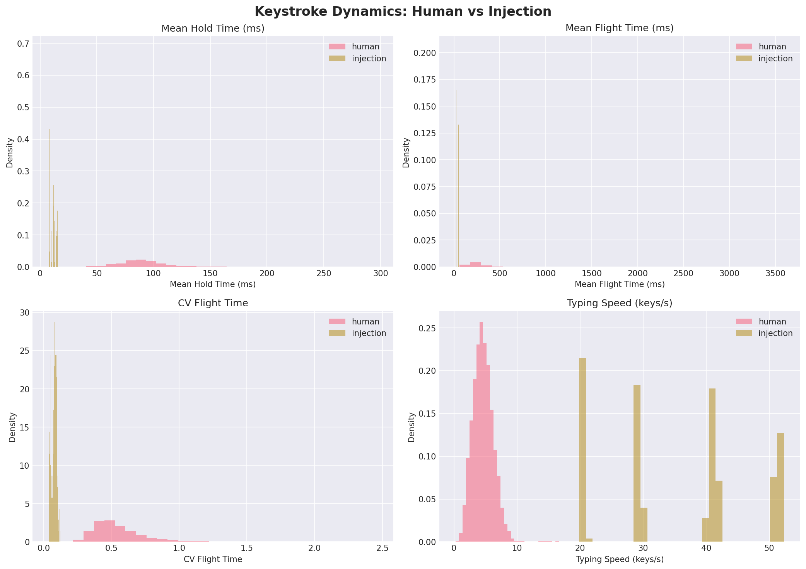
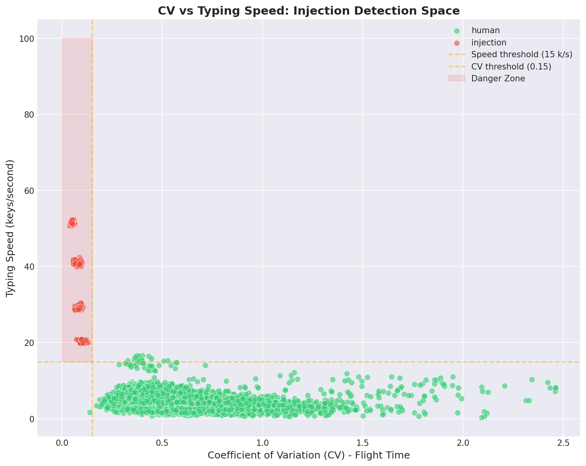
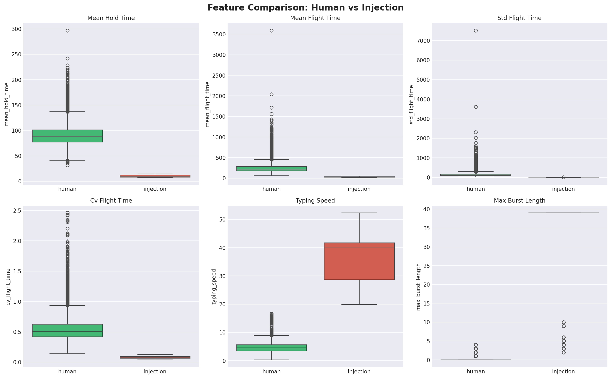
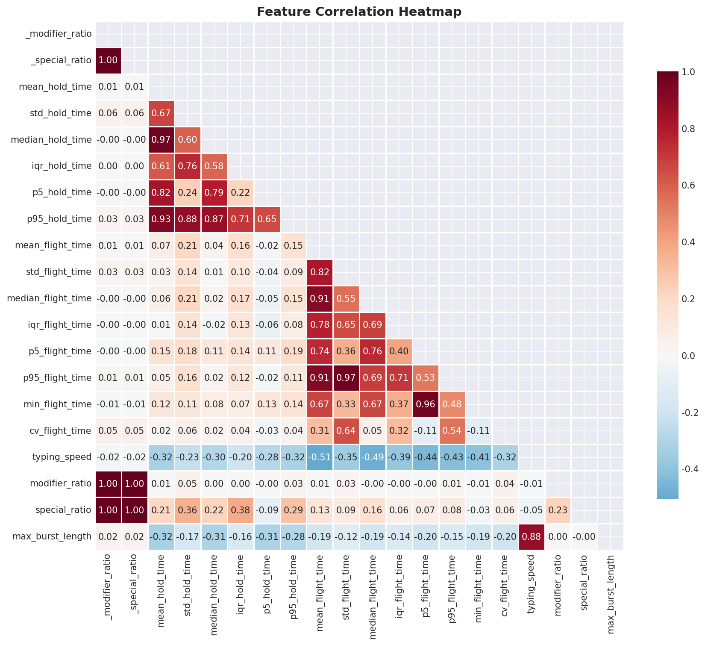
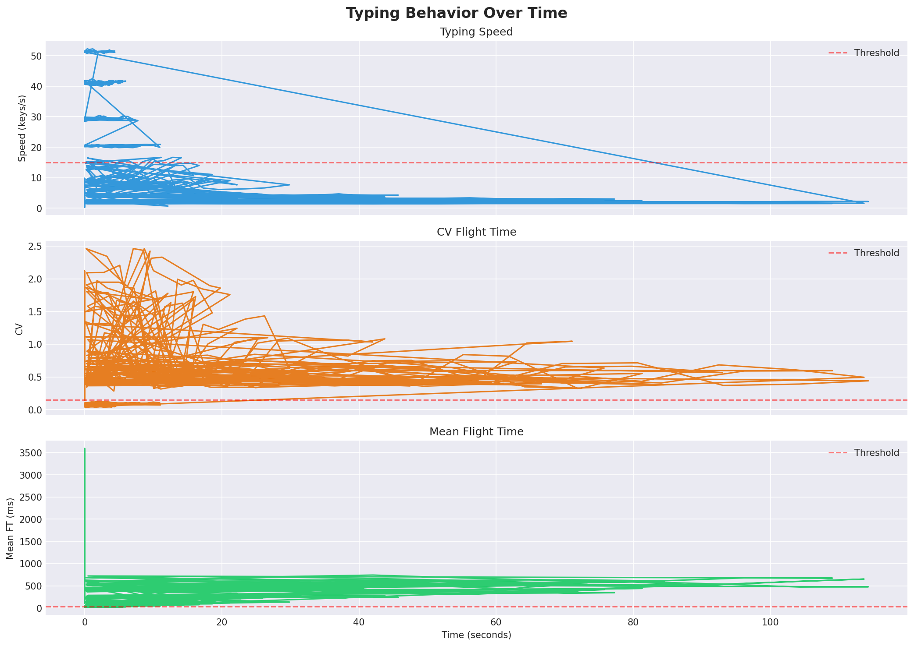
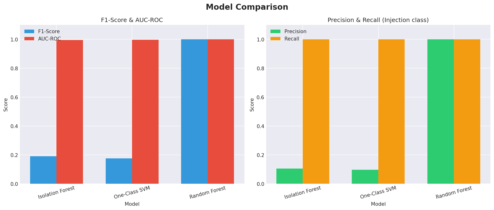

# Chương 3. KẾT QUẢ THỰC NGHIỆM

## 3.1. Môi trường thực nghiệm

### 3.1.1. Phần cứng

*Bảng 3.1: Cấu hình phần cứng thực nghiệm*

| Thành phần | Thông số |
|------------|----------|
| CPU        | [Ghi thông số CPU của bạn]   |
| RAM        | [Ghi dung lượng RAM]         |
| Storage    | [Ghi loại SSD/HDD]           |
| OS         | Windows 10/11                 |

### 3.1.2. Phần mềm

*Bảng 3.2: Phần mềm sử dụng*

| Công cụ       | Phiên bản | Mục đích                |
|----------------|-----------|--------------------------|
| Rust           | stable    | Collector & Detection     |
| Python         | 3.10+     | ML training, analysis     |
| scikit-learn   | 1.x       | ML models                 |
| Streamlit      | 1.x       | Dashboard                 |
| Plotly         | 5.x       | Visualization             |

### 3.1.3. Cấu hình Detection

```text
window_size       = 40         (40 phím mỗi cửa sổ)
slide_step        = 20         (trượt 20 phím)
ft_threshold      = 30ms       (Flight Time ngưỡng)
cv_threshold      = 0.15       (CV ngưỡng)
speed_threshold   = 15 k/s     (Tốc độ ngưỡng)
burst_threshold   = 15         (Burst ngưỡng)
```

## 3.2. Bộ dữ liệu (Dataset)

### 3.2.1. Tổng quan dataset

*Bảng 3.3: Tổng quan dataset*

| Thuộc tính            | Giá trị                          |
|-----------------------|----------------------------------|
| Tổng số mẫu           | 21,035 feature vectors           |
| Mẫu human             | 20,803 (98.9%)                   |
| Mẫu injection         | 232 (1.1%)                       |
| Số features            | 16 đặc trưng chính               |
| Số nguồn dữ liệu      | 3 nguồn                          |

### 3.2.2. Nguồn 1: CMU Keystroke Dynamics Benchmark

Dataset chuẩn từ Carnegie Mellon University [14]. 51 người tham gia, mỗi người gõ password ".tie5Roanl" 400 lần (8 sessions × 50 reps).

Xử lý: File `DSL-StrongPasswordData.csv` (4.6 MB) → script `integrate_datasets.py --cmu` → 20,400 feature vectors từ 51 users.

Thống kê: Hold Time trung bình 80–150ms, Flight Time trung bình 100–300ms.

### 3.2.3. Nguồn 2: Thu thập bằng Python Collector

Công cụ: `collect_keystrokes.py` (thư viện pynput). Người tham gia gõ 3 đoạn text × 5 lần mỗi đoạn. Dữ liệu raw lưu vào `data/keystroke_log_user_*.csv`, chuyển đổi bằng `integrate_datasets.py --self-collect`.

### 3.2.4. Nguồn 3: Thu thập bằng Rust Collector

Công cụ: `kds_guard.exe --collect-only --log-keys`. Người tham gia sử dụng script `thu_thap_rust.bat`, gõ tự do trong Notepad, mỗi session 30–60 giây. Dữ liệu raw lưu vào `data/raw/rust/*.csv`, chuyển đổi bằng `integrate_datasets.py --rust-collect`.

### 3.2.5. Dữ liệu Injection mô phỏng

*Bảng 3.4: Các loại injection mô phỏng*

| Loại             | Tốc độ       | CV         | Mô tả                              |
|------------------|--------------|------------|--------------------------------------|
| badusb_fast      | 80–120 k/s   | 0.02–0.05  | BadUSB tốc độ cao, rất đều           |
| badusb_medium    | 30–50 k/s    | 0.05–0.10  | BadUSB tốc độ trung bình             |
| script           | 20–40 k/s    | 0.08–0.15  | Script automation                     |
| rubber_ducky     | 50–100 k/s   | 0.03–0.08  | USB Rubber Ducky pattern              |

Tổng injection samples: 232 feature vectors được tạo bằng `generate_demo_data.py` và `injection_simulation.py`.

## 3.3. Kết quả huấn luyện mô hình

### 3.3.1. Thiết lập training

- Train/Test split: 80/20 (stratified).
- Scaler: StandardScaler (mean=0, std=1).
- Contamination (IF, OCSVM): 0.10.
- Ngày huấn luyện: 2026-03-08.
- Tổng samples: 21,035.

### 3.3.2. So sánh kết quả

*Bảng 3.5: Kết quả so sánh 5 phương pháp phát hiện*

| Phương pháp                  | Accuracy | Precision | Recall | F1-Score | AUC-ROC |
|-------------------------------|----------|-----------|--------|----------|---------|
| **Rule-based**                | 1.0000   | 1.0000    | 1.0000 | 1.0000   | 1.0000  |
| Isolation Forest              | 0.9103   | 0.1095    | 1.0000 | 0.1974   | 0.9954  |
| One-Class SVM                 | 0.9002   | 0.0995    | 1.0000 | 0.1810   | 0.9975  |
| **Random Forest**             | 1.0000   | 1.0000    | 1.0000 | 1.0000   | 1.0000  |
| **Hybrid (R:0.6, ML:0.4)**   | 1.0000   | 1.0000    | 1.0000 | 1.0000   | 1.0000  |

**Nhận xét:** Rule-based, Random Forest, và Hybrid đạt kết quả hoàn hảo (F1 = 1.0, AUC = 1.0). Isolation Forest và One-Class SVM có Recall = 1.0 (bắt hết injection) nhưng Precision thấp do False Positive cao (do contamination parameter).

### 3.3.3. Confusion Matrix

*Bảng 3.6: Confusion Matrix — Rule-based*

|                       | Predicted Human | Predicted Injection |
|-----------------------|-----------------|---------------------|
| **Actual Human**      | 20,803          | 0                   |
| **Actual Injection**  | 0               | 232                 |

→ Zero False Positives, Zero False Negatives.

*Bảng 3.7: Confusion Matrix — Random Forest*

|                       | Predicted Human | Predicted Injection |
|-----------------------|-----------------|---------------------|
| **Actual Human**      | 20,803          | 0                   |
| **Actual Injection**  | 0               | 232                 |

→ Kết quả hoàn hảo, tương tự Rule-based.

*Bảng 3.8: Confusion Matrix — Isolation Forest*

|                       | Predicted Human | Predicted Injection |
|-----------------------|-----------------|---------------------|
| **Actual Human**      | 18,916          | 1,887               |
| **Actual Injection**  | 0               | 232                 |

→ Recall = 100%, nhưng FP = 1,887 (9.1%) — quá nhiều báo nhầm.

*Bảng 3.9: Confusion Matrix — One-Class SVM*

|                       | Predicted Human | Predicted Injection |
|-----------------------|-----------------|---------------------|
| **Actual Human**      | 18,704          | 2,099               |
| **Actual Injection**  | 0               | 232                 |

→ Recall = 100%, FP = 2,099 (10.1%) — False Positive cao nhất trong các phương pháp.

### 3.3.4. Latency (Thời gian phản hồi)

*Bảng 3.10: Latency so sánh*

| Phương pháp       | Latency/sample |
|--------------------|----------------|
| Random Forest      | 0.012 ms       |
| Isolation Forest   | 0.013 ms       |
| One-Class SVM      | 0.476 ms       |

Tất cả đều đáp ứng yêu cầu real-time (< 1ms per sample). Random Forest và Isolation Forest nhanh gần 40 lần so với One-Class SVM.

## 3.4. Phân tích kết quả

### 3.4.1. Biểu đồ phân bố

*Hình 3.1: Biểu đồ phân bố Flight Time (human vs injection)*



Human typing có Flight Time trung bình 100–400ms với phân bố rộng, trong khi injection tập trung ở vùng < 30ms. Sự tách biệt rõ ràng giải thích tại sao Rule-based đạt F1 = 1.0.

### 3.4.2. Biểu đồ phân tán (Detection Space)

*Hình 3.2: Biểu đồ phân tán CV vs Typing Speed*



Vùng nguy hiểm: CV < 0.15 AND Speed > 15 k/s (góc trên-trái). Injection samples tập trung rõ ở vùng này, tách biệt hoàn toàn với human. Đây là 2 features quan trọng nhất cho detection.

### 3.4.3. Biểu đồ so sánh đặc trưng

*Hình 3.3: Boxplot so sánh đặc trưng human vs injection*



Sự khác biệt rõ rệt ở Mean Flight Time, CV, và Typing Speed giữa hai lớp. Injection có phân bố rất hẹp (IQR nhỏ), trong khi human có phân bố rộng (biến thiên tự nhiên).

### 3.4.4. Tương quan đặc trưng

*Hình 3.4: Ma trận tương quan đặc trưng (Correlation Heatmap)*



Cụm tương quan cao: (mean_flight_time, median_flight_time) ~ 0.95 — cho thấy tính nhất quán. Typing_speed tương quan ngược với flight_time (tốc độ cao → flight time thấp).

*Hình 3.5: Biểu đồ hành vi theo thời gian*



So sánh mẫu gõ phím liên tục: human có biến thiên tự nhiên, injection ổn định bất thường.

*Hình 3.6: Biểu đồ so sánh hiệu năng mô hình*



Rule-based, Random Forest, và Hybrid đạt F1 = 1.0. IF và OCSVM có AUC cao (> 0.99) nhưng F1 thấp do FP.

## 3.5. Giao diện Dashboard

Dashboard Streamlit gồm 5 tabs:

- **Tab 1 — Overview**: Tổng quan hệ thống (số events, windows, injections, avg speed).
- **Tab 2 — Live Monitor**: Giám sát real-time typing speed và CV.
- **Tab 3 — Analysis**: Scatter CV vs Speed, histogram, correlation heatmap.
- **Tab 4 — Model Performance**: So sánh F1, AUC, detail table.
- **Tab 5 — Detection Log**: Bảng filterable, download CSV.

Chạy: `streamlit run dashboard/dashboard.py` → mở tại http://localhost:8501.

## 3.6. Demo kết quả

### 3.6.1. Demo 1: Human Typing → NORMAL

```text
╔══════════════════════════════════════════════════╗
║  🛡️  KDS Guard v0.1.0                            ║
║  Mode: 🔍 Detection Active                       ║
╚══════════════════════════════════════════════════╝

[DEBUG] 📊 Features: speed=7.2 k/s, CV=0.452, burst=0
→ Kết quả: Risk NORMAL. Không có cảnh báo.
```

### 3.6.2. Demo 2: Injection Attack → CRITICAL

```text
╔══════════════════════════════════════════════════╗
║  🔴 CẢNH BÁO - Risk Score: 0.95                 ║
╠══════════════════════════════════════════════════╣
║  • Flight time trung bình rất thấp: 8.5ms       ║
║  • Hệ số biến thiên CV rất thấp: 0.035          ║
║  • Tốc độ gõ bất thường: 47.2 keys/s            ║
║  • Burst pattern detected: 42 phím liên tiếp    ║
║  • Hold time rất đều (IQR: 1.50ms)              ║
╚══════════════════════════════════════════════════╝
→ Kết quả: PHÁT HIỆN TẤN CÔNG HID INJECTION!
```

### 3.6.3. Demo 3: Dashboard

Dashboard hiển thị đầy đủ: 21,035 events, 232 injections detected, real-time charts, model comparison, và detection log.
